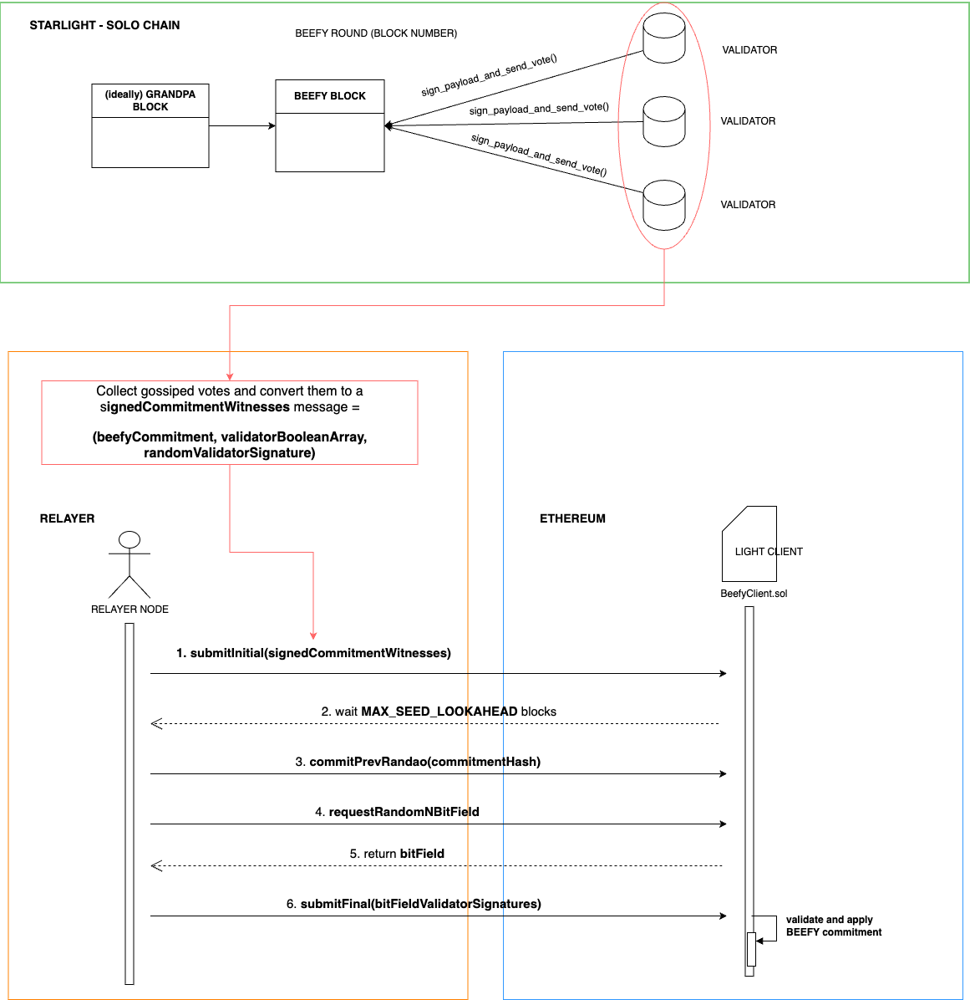

# State synchronization flow from Starlight to Ethereum

## BEEFY

BEEFY (Binary Enhanced Extra Fast Yield) is a light client protocol for Polkadot that enables efficient finality proofs using [Merkle Mountain Ranges](https://spec.polkadot.network/sect-finality#defn-mmr). It reduces the amount of data that needs to be relayed between chains by focusing on specific validator signatures.

On its core, BEEFY allows components of a remote network (such as Ethereum) to verify the state (finality proofs) created by the origin chain (Polkadot, Starlight, etc.).

The goals of BEEFY (according to Polkadot’s spec) are:

- Allow customization of signature schemes to adapt to different target chains.
- Minimize the size of the finality proof and the effort required by a light client to follow finality.
- Unify data types and use backward-compatible versioning so that the protocol can be extended (additional payload, different signature schemes) without breaking existing light clients.

BEEFY consists of two components:

a. **Consensus Extension** on GRANDPA finalization (voting round).

b. An efficient **protocol** for convincing on-chain/ off-chain light clients about the finality vote (relayer).

## Voting round

A “voting round” on BEEFY is basically the time gap where BEEFY validators vote over a specific block (round number). More specifically, they vote for the Commitment for that block number.

The current round ends when the next round starts, which might happen when:

1. Either the node collects `2/3rd + 1` valid votes for that round.
2. Or the node receives a BEEFY Justification for a block greater than the current best BEEFY block.

Each node determines what it believes the next round number is, based on the following:

1. Best GRANDPA finalized block number (`best_grandpa`).
2. Best BEEFY finalized block number (`best_beefy`).
3. Starting block of the current session (`session_start`).

See [the formula](https://spec.polkadot.network/sect-finality#defn-beefy-round-number) in Polkadot’s spec for more detailed explanation.

Something important to note is that while BEEFY **can** vote on top of GRANDPA-finalized blocks, it does **not have to**. BEEFY can select **any recent block** as a checkpoint (based on the above criteria), even if it hasn't yet been finalized by GRANDPA. This allows BEEFY to provide faster and more efficient finality for external chains, especially when the full GRANDPA finality process is too slow for cross-chain communication purposes.

## Vote Message

On each BEEFY round, validators create a direct vote and gossip it to its peers. As part of a vote, validators sign over the Payload present inside the Beefy Commitment. You can check the full definition [here](https://spec.polkadot.network/chap-networking#defn-msg-beefy-gossip).

The Payload is basically the Merkle root of the whole MMR generated. The leaf data inside It contains several fields for each past block (full definition [here](https://spec.polkadot.network/sect-finality#defn-beefy-payload)).

## Relayer’s role

To submit BEEFY proofs to Ethereum (or any other remote network), the relayer first collects all the BEEFY gossiped votes of the origin chain’s validators, and convert them to a **Signed Commitment Witnesses** data structure, which is composed by the BEEFY commitment itself, a randomly selected validator signature, and an initial bitfield claiming which validators have signed the commitment.

```code
signedCommitmentWitnesses = (beefyCommitment, validatorBooleanArray, randomValidatorSignature)
```

After building the `signedCommitmentWitnesses` message, the relayer starts interacting with the light client on Ethereum (`BeefyClient.sol`) and performs some steps, which in case of Snowbridge are the following ones:

1. `submitInitial` - In the first transaction, the relayer submits the `signedCommitmentWitnesses` message.
2. The relayer then waits [MAX_SEED_LOOKAHEAD](https://eth2book.info/bellatrix/part3/config/preset/#max_seed_lookahead) blocks.
3. `commitPrevRandao` - The relayer submits a second transaction to reveal and commit to a random seed, derived from Ethereum's [RANDAO](https://eips.ethereum.org/EIPS/eip-4399).
4. The relayer requests from the light client a bitfield with N*N*randomly chosen validators sampled from the initial bitfield.
5. `submitFinal` - The relayer sends a third and final transaction with signatures for all the validators specified in the final bitfield

After all the previous steps, the light client verifies all validator signatures in the third transaction and checks if:

1. The provided validators are in the current validator set
2. The provided validators are in the final bitfield
3. The provided validators have signed the beefy commitment

If those checks succeed and the third transaction is valid, then the payload inside the BEEFY commitment is applied.

## Starlight → Relayer → Ethereum: overall workflow diagram
<p align="center">
  
</p>