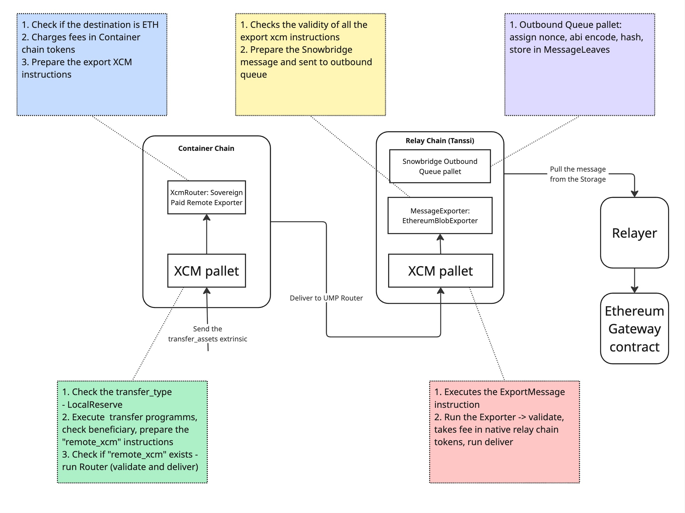

# Transfer container chain token to Ethereum

This section provides technical details on how the transfer of tokens from a container chain to Ethereum is implemented
in the Tanssi runtime.
We use XCMP protocol to transfer tokens from the container chain to the Ethereum chain.

Below is the high-level diagram of the E2E flow to transfer tokens from the container chain to
Ethereum ([source](https://miro.com/app/board/uXjVIWgGZ3s=/?moveToWidget=3458764632714818053)):

### Prerequisites

Before transferring the container chain token to Ethereum, the following prerequisites must be met:

- The container chain token must be registered in the snowbridge system via the extrinsic call: "
  snowbridge-pallet-system" -> "register_token".

### The flow description

1. The transfer is triggered via the "pallet-xcm" -> "transfer_assets" extrinsic.
2. It processed by the "pallet-xcm" pallet:
    - Checks the transfer_type - LocalReserve
    - Executes the transfer programms, checks beneficiary, prepare the "remote_xcm" instructions
    - Checks if "remote_xcm" exists - run Router (validate and deliver):
3. What Router does:
    - Check if the destination is ETH
    - Charges fees in Container chain tokens
    - Prepare the export XCM instructions
4. Then the message goes to UMP Router and transferred to relay chain
5. Relay chain:
    - Executes the ExportMessage instruction
    - Run the Exporter -> validate, takes fee in native relay chain tokens, run deliver
6. Message Exporter:
    - Checks the validity of all the export xcm instructions
    - Prepare the Snowbridge message and sent to outbound queue
7. Outbound queue pallet:
    - assign nonce, abi encode, hash, store in MessageLeaves
8. Now Relayers can pick up the message from the storage and send it to Ethereum