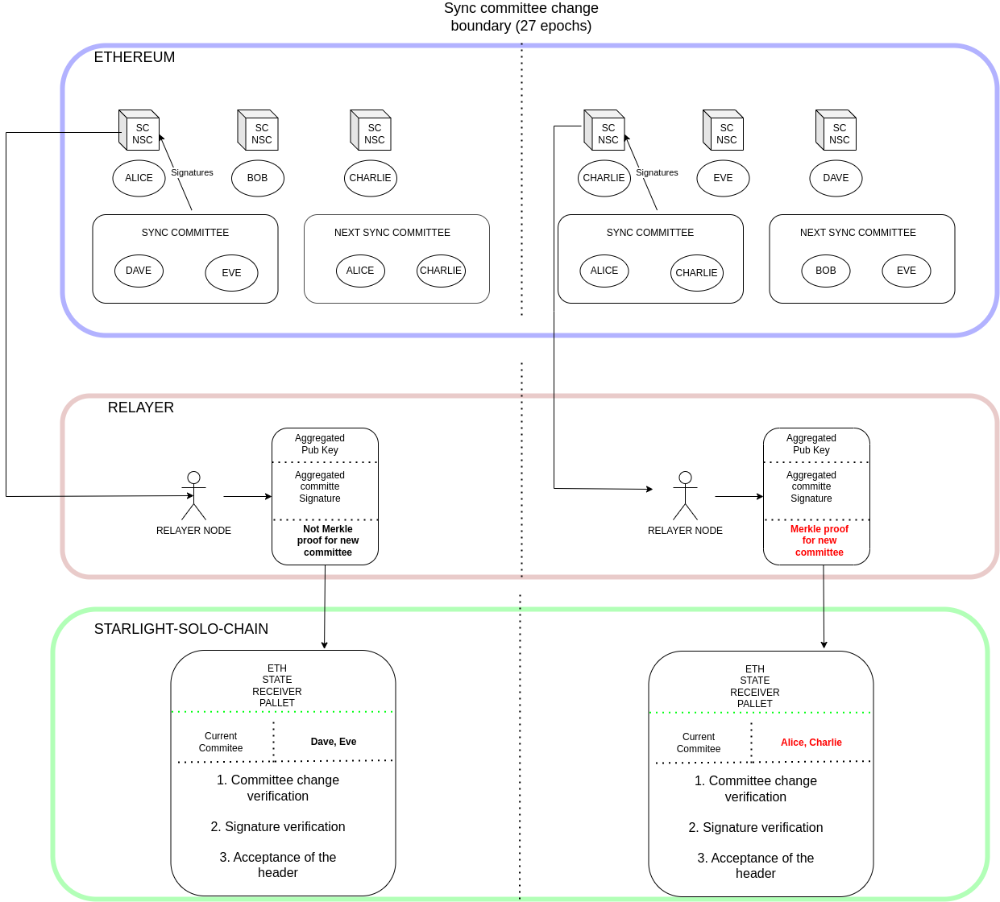
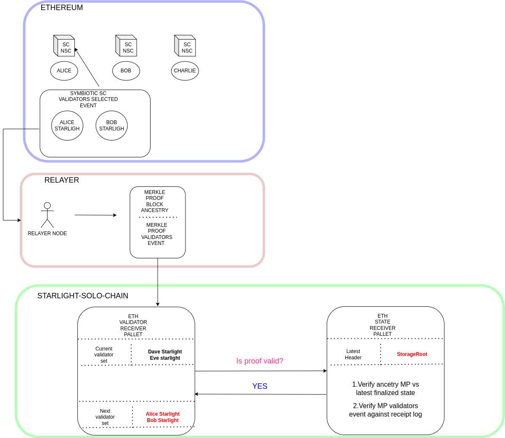

# Ethereum State Verification Diagram

## Altair Sync protocol

### Preliminaries
- Ethereum epochs consis of 32 slots, where each slot is 12s
- Ethereum distributes all validators in attestation 32 attestation committees (one per slot)
- At the beginning of each epoch, each validator is assigned a slot
- Ethereum pseudo-randomly selects, among all validators, a block producer for a slot n
- The block produced for slot n needs to be attested by the attestation committee for slot n

### The need for a sync protocol
- For a light client, determining the canonical chain can become expensive (as we need to verify a bunch of attestions)
- In order to verify a block header, you need the information of the previous header

### The Altair sync protocol
- A sync committe made up of 512 pseudo-randomly chosen validators is selected every 256 epochs (approx, 27hours)
- Each block header includes the aggregated signature of the validators in the sync committee,
- Each header lists the current and the next sync committee
- Sync committee members are rewarded with 0.1ETH for their service, and they are charged that amount if they dont sign
- 2/3rds quorum needs to be reached
- For now sync committee members are not slashed if the vote for a malicious header (although subject to change after EIP-7657)

### Definitions and abreviations
- SC: Current Sync Committee
- NSC: Next Sync Committee
- Attested header: the header for which we have the signatures by the sync committee
- Finalized header: the latest finalized header, can be different to attested header (e.g., the latest finalized block is 5 but we have sync committee signatures for 7)
- Slot: an interval of 12s
- Period: A range of slots, in this case 8192 slots (around 27 hours)
### Verification PseudoCode and explanation

The pseudo-code for the verification update can be found in [Altair](https://github.com/ethereum/annotated-spec/blob/master/altair/sync-protocol.md). We describe the pseudo-code in our own words in the following steps:

1. First we verify that the update is meaningful, which basically means that the slot number provided is higher than the one stored in the light client
2. Second we verify that the period is either the current one stored or the following one. OBviously an update for a past period cannot be provided,  neither we can skip period updates by injecting a period too far in the future.
3. If we arre injecting an attested header (header for which the sync committee provided signatues) that is different than the finalized heaer (latest finalized header), a merkle proof verification is carried out to verify the validity of the finalized header in the attested header
4. We take the sync committee against which we have to verify the signatues. In this case we have two options
4.1 If the period of the attested header is the same one as we have stored, we take the current sync committe (SC), and verify the signatures against it.
4.2 If the period of the attested header is higher (+1) of the latest one stored, then we take the next sync committee(NSC), and additionally, the prover needs to inject a merkle proof for the following next committee that needs to be validated.
5. The aggreagated signature is verified against the selected committee.
6. The header is accepted

## Transmiting Ethereum Headers to Starlight

### The relayers job to transmit Ethereum's header
1. The relayer node needs to collect the aggergated sync committee signature embeedded into the Ethereum block 
2. The relayer needs to aggregrate the public keys responsible for generating that block.
3. If the sync committee changes, the relayer needs to generate a merkle proof proving that the sync committee has changed.
4. The relayer presents all these components to the appropriate pallet in starlight

### Eth state receiver pallets job
1. If the relayer claims the sync committee changes, verify the merkle proof to make sure the new sync committee is correct.
2. Perform a verification of the validity of the committee members that signed the aggregated message
3. Perform a verification of the aggregated signature
4. If all of those pass, accept the header, with the new **state root ready to receive storage proofs**

### Overall Diagram ETH state validity Reception

This is our own diagram, but a more low level diagram can be found in [Altair low-level diagram](https://github.com/ethereum/annotated-spec/raw/master/altair/lightsync.png)

  

## Proving symbiotic validator selection to starlight (or any other Ethereum state)

### The relayers job to transmit symbiotic validators
1.  We assuume there exists a contract that emits an event indicating the new validators, which is verifiable against the transaction receipt trie root in the block.
2. The relayer node checks the latest accepted header in starlight, and it generates a merkle proof of this event against the latest stored header
3. The relayer sends this information to the Symbiotic validator receiver pallet

### The Symbiotic validator Receiver pallets job to verify the validators

1. The symbiotic validator pallet receiver asks the Ethereum state receiver pallet about the correctness of the validators.
2. The ethereum state pallet receiver repplies with a yes or no, depending on the validity of the storage proof against the storage root stored
3. If accepted, the next validator set is stored on-chain
4. In the next session, the new era will get started

### Overall Diagram Validator Information passing

  

